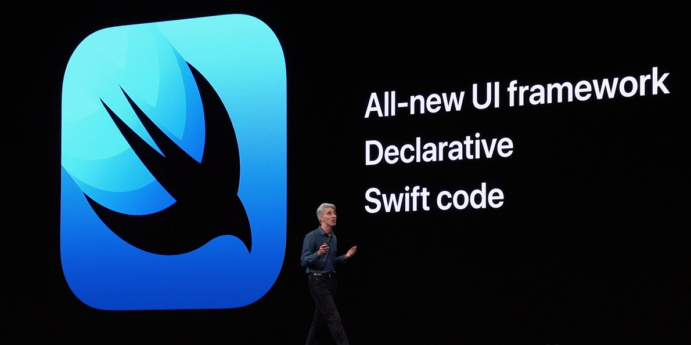

# Présentation

## Qu'est-ce que le développement iOS ?

Le développement iOS consiste à développer des applications qui ciblent principalement l'iPhone et l'iPad mais aussi macOS, iWatch et Apple TV.
Il existe plusieurs façons d'y parvenir :

- En utilisant les frameworks et outils officiels fournis par Apple.
- En utilisant des frameworks et outils tiers tels que Capacitor, MAUI et FLutter.

Cette formation se concentre sur le développement iOS en utilisant les outils et frameworks officiels proposés par Apple.
Notre pile de développement sera composée des éléments suivants :

- Langage de programmation : Swift
- Framework UI : SwiftUI
- IDEs : Xcode

En outre, il est également possible d'exploiter le langage Swift (sans SwiftUI) afin de développer des applications console et des serveurs sur Windows, Linux, macOS.

## Historique

Les premiers jours du développement d'iOS utilisaient le langage Objective-C, le framework UIKit et le bon vieux Xcode.
Cet écosystème était basique mais assez puissant et permettait de développer des applications de qualité.
Les mises à jour continues d'Apple ont amélioré l'expérience des développeurs.
Par exemple, la gestion de la mémoire est devenue automatique (grâce à ARC) et il est devenu possible de développer des vues qui s'adaptent aux différentes tailles d'écran.

Lors de la WWDC 2014, Apple a annoncé le langage Swift en tant que remplacement moderne et Open Source de l'Objective-C.
Suite à cela, Apple a annoncé lors de la WWDC suivante SwiftUI comme le remplacement de UIKit.

À partir de 2021, la majorité des nouveaux projets iOS utilisent Swift et SwiftUI avec UIKit comme solution de repli pour les aspects UI.

## Liens et références

- Apple annonce SwiftUI, un cadre d'interface utilisateur déclaratif moderne pour les plateformes Apple](https://9to5mac.com/2019/06/03/apple-announces-swiftui-a-modern-declarative-user-interface-framework-for-apple-platforms/)
- Apple publie Swift en tant que source ouverte] (https://www.apple.com/newsroom/2015/12/03Apple-Releases-Swift-as-Open-Source/)
- L'histoire du développement d'applications iOS (de iOS 1 à 8)](https://www.sutori.com/en/story/the-history-of-ios-app-development--hzFfwkD2KYLaa5WrxsrUFGMh)
- [Historique d'iOS de 2007 à 2018](https://www.timetoast.com/timelines/history-of-ios)