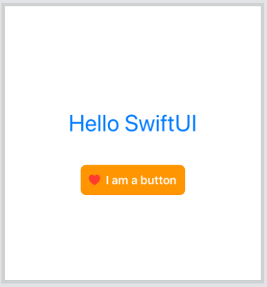
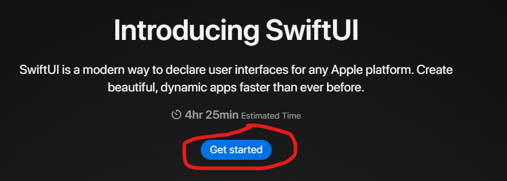
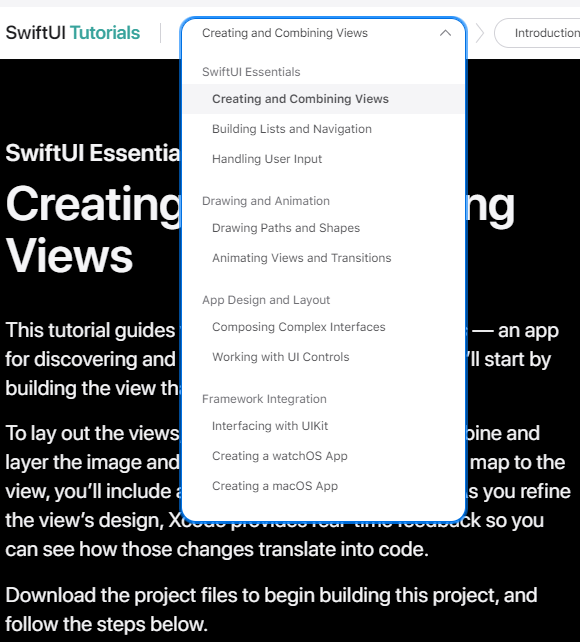

# Développement de l'interface utilisateur

::: tip Temps estimé
1/2 journée
:::

Il existe deux frameworks UI officiels fournis par Apple : UIKit et SwiftUI.

UIKit est le framework historique initialement utilisé pour le développement de l'interface utilisateur.
Il repose sur la définition de l'UI dans un fichier séparé (storyboard ou xib) et du comportement dans un fichier swift.
En 2019, Apple a publié la première version de SwiftUI qui apporte des changements drastiques -et bienvenus- par rapport à UIKit. 

Cette formation se concentre sur SwiftUI.

## SwiftUI 

SwiftUI apporte une nouvelle approche pour construire des UI que nous pouvons résumer comme suit :

- Toute l'interface utilisateur est définie dans le code Swift. Ni les Storyboards ni les xibs ne sont plus nécessaires.
- L'interface utilisateur est définie dans un style déclaratif.
- Les State et les Bindings permettent de contenir les données de l'application. L'interface utilisateur se met à jour automatiquement lorsque ces données changent.
- Les éléments de l'interface sont des structures qui se conforment au protocole View.
- Les vues complexes peuvent être définies en les divisant en vues plus petites. C'est ce qu'on appelle la composition de vues.
- La technique du modificateur est utilisée pour appliquer des modifications à une vue. Un modificateur renvoie une nouvelle vue à chaque fois.

La [documentation officielle de SwiftUI est disponible ici](https://developer.apple.com/documentation/swiftui).

## Prérequis pour développer en SwiftUI

Il est recommandé d'utiliser Xcode pour créer des applications SwiftUI.
Pour les applications simples et pour apprendre SwiftUI, nous pouvons utiliser l'application [Swift Playgrounds](https://www.apple.com/swift/playgrounds/).
Il existe aussi un [playground web](https://swiftui-playground.kishikawakatsumi.com/) qui peut être exceptionnellement utilisé.
Vous pouvez voir une capture d'écran de l'outil ci-dessous.


Une autre alternative prometteuse à surveiller est [le portage Windows créé par compnerd](https://github.com/compnerd/swift-win32) de UIKit et SwiftUI.
Pour la suite, il est donc fortement recommandé d'utiliser Xcode.

## Anatomie d'une vue simple

Le code suivant montre un exemple de vue.

```swift
struct ContentView : View {
    var body : some View {
        VStack {
            Text("Bonjour SwiftUI")
                .font(.largeTitle)
                .foregroundColor(.blue)
                .padding()
            Bouton(action : {}) {
                HStack {
                    Image(systemName : "suit.heart.fill")
                        .foregroundColor(.rouge)
                    Text("Je suis un bouton")
                        .font(.headline)
                        .foregroundColor(.white)
                }
                .padding(12)
                .background(Couleur.orange)
                .cornerRadius(8)
            }
        }
    }
}
```

Comme indiqué précédemment, il s'agit d'une structure conforme au protocole View.
Ce protocole définit une propriété calculée qui renvoie une vue comme type opaque.

Le corps de la vue a une `VStack` comme élément racine.
Une `VStack` est une vue conteneur qui dispose ses enfants directs verticalement (sur une colonne).
Le premier enfant est une vue `Text` et son deuxième enfant est un `Button`.

Cette vue `Text` enchaîne les appels à certaines méthodes que nous appelons *modificateurs*.
Ils permettent de faire tout ce que l'on veut à la vue qui les a appelées et ils retournent une nouvelle instance de `View`.
Cela signifie que nous pouvons appliquer un autre modificateur au résultat d'un modificateur et ainsi de suite (c'est ce qu'on appelle le chaînage).
Cela permet aux modificateurs d'avoir une syntaxe déclarative qui rend le code facile à comprendre.
SwiftUI fournit des modificateurs intégrés et nous permet d'en créer de nouveaux.
Pouvez-vous identifier tous les modificateurs utilisés dans le code et leurs effets ?

::: details Les modificateurs utilisés sont :
```swift
font(...)
foregroundColor(...)
padding(...)
background(...)
cornerRadius(...)
```
:::

Le bouton n'a pas d'action -ce qui signifie qu'il ne fait rien au clic- et son contenu est défini comme une `HStack`.
Une `HStack` est une vue conteneur qui dispose ses enfants directs horizontalement (sur une ligne).
La pile (stack en anglais) contient une image et un bouton.

Le rendu de la vue est illustré par l'image ci-dessous.



## TP : compléter le tutoriel officiel SwiftUI

Apple fournit un [tutoriel SwiftUI](https://developer.apple.com/tutorials/swiftui) qui couvre la plupart des cas d'utilisation de base tels que la création de vues et la gestion de la saisie, des animations et des transitions.

Vous pouvez lancer le tutoriel en cliquant sur "Get started". 



Vous pouvez également naviguer entre les différents tutoriels en utilisant la barre supérieure.



## Un résumé des concepts importants

- État : 
- Liaison
- EnvironnementObjet
- Observable

