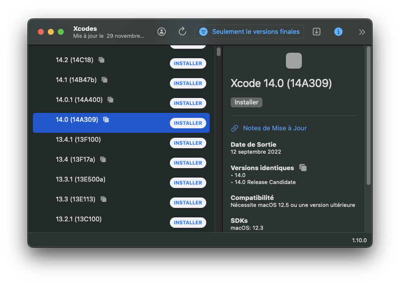
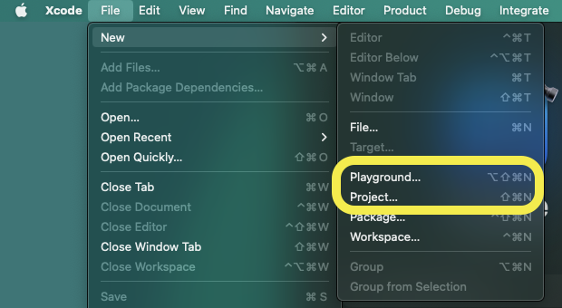

# Presentation

## Welcompe the world of iOS development

iOS development consists of developing applications that can target mainly the iPhone and iPad but also macOS, iWatch and Apple TV.
There are many ways to achieve this:

- Using the official frameworks and tools provided by Apple
- Using 3rd party frameworks and tools such as Capacitor, MAUI and Flutter

This training focuses on iOS development using the official tools and frameworks proposed by Apple.
Our development stack will consist of the following items:

- Programming language: Swift
- UI Framework: SwiftUI
- IDEs: Xcode and Swift Playgrounds

In addition to that, It is also possible to leverage the Swift language (without SwiftUI) in order to develop console apps and servers on Window, Linux, macOS.

## History

The early days of iOS development used the Objective-C language, the UIKit UI Framework and -the good old- Xcode.
This ecosystem was basic but quite powerful and allowed to develop amazing apps.
The continuous updates from Apple improved the developer experience.
For example, memory management became automatic (thanks to ARC) and the layout system became capable of adapting to different screen sizes.

In WWDC 2014, Apple announced the Swift language as an Open Source modern replacement to Objective-C.
Following that, apple announced during the next WWDC SwiftUI as the replacement for UIKit.

As of 2021, the majority of new iOS projects use Swift and SwiftUI with UIKit as a fallback for the UI aspects.

## Getting started

- On macOS, install [Xcodes]() and [Swift Playgrounds](https://apps.apple.com/us/app/swift-playgrounds/id1496833156?mt=12).
  - Xcodes is a tools that downloads and manages the different versions of Xcode.

- For windows and Linux users you can install [Swift for Windows](https://swiftforwindows.github.io/) or [Swift for Ubuntu](https://swift.org/download/#releases). This will allow you to run Swift code on your machine.
  - You can use VSCode or Fleet as an IDE.
  - Unfortunately, SwiftUI development either challenging or not supported. (on Windows you can try to use [swift-win32](https://github.com/compnerd/swift-win32))
- Open a terminal and run the following command to check if Swift is installed `swift --version`.

### Create a CLI app with swift CLI

- Open a terminal in an empty folder `mkdir MyCLI` and then `cd MyCLI`
- Create the project with `swift package init --name MyCLI --type executable`
- and run it with `swift run`. It should print -> **Hello world**

### Create an App using Xcode or Swift playgrounds

- On Xcode, create a either a **Project** or **Playground** and run it.

## Swift project managers

- Official tools:
  - [Swift Package Manager](https://swift.org/package-manager/) (also called swiftpm) is the official tool to manage Swift projects. It is platform and IDE agnostic.
  - Xcode projects are projects fully managed by Xcode (.xcodeproj)
- 3rd party tools:
  - [Carthage](https://github.com/Carthage/Carthage)
  - [CocoaPods](https://cocoapods.org/)

In this training, we'll use swiftpm and Xcode.

## Links and references

- [Apple announces SwiftUI, a modern declarative user interface framework for Apple platforms](https://9to5mac.com/2019/06/03/apple-announces-swiftui-a-modern-declarative-user-interface-framework-for-apple-platforms/)
- [Apple Releases Swift as Open Source](https://www.apple.com/newsroom/2015/12/03Apple-Releases-Swift-as-Open-Source/)
- [The History of iOS App Development (from iOS 1 to 8)](https://www.sutori.com/en/story/the-history-of-ios-app-development--hzFfwkD2KYLaa5WrxsrUFGMh)
- [History of iOS from 2007 to 2018](https://www.timetoast.com/timelines/history-of-ios)