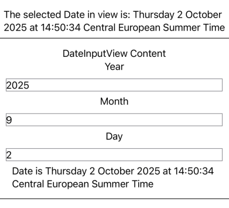

# UI development

::: tip Estimated time
1/2 day
:::

Apple provides two official UI frameworks : UIKit and SwiftUI.

UIKit is the originally used framework for UI development.
It relies on defining the UI in a separate file (storyboard or xib) and the behavior in a swift file.
In 2019, Apple release the first version of SwiftUI.

The remainder of this training focuses on SwiftUI.

## SwiftUI

SwiftUI brings a new approach to build UIs that we can summarize as follows:

- All the UI is defined in Swift code. Neither Storyboards nor xibs are needed anymore.
- The UI is defined in a declarative style.
- States and bindings allow to hold the app data. The app UI updates automatically when these data change.
- UI elements are structs that conform to the View protocol.
- Complex views can be defined by breaking them into smaller views. This is called view composition.
- The modifier technique is used to apply modifications to a view. A modifier returns a new view each time.

The [official documentation of SwiftUI is available here](https://developer.apple.com/documentation/swiftui).

## Prerequisites

It is recommended to use Xcode to learn and create SwiftUI apps.
For simple apps, we can use the [Swift Playgrounds](https://www.apple.com/swift/playgrounds/) app or create a Playground in Xcode.

## Anatomy of a basic view

The following code shows a sample view.

```swift
struct ContentView: View {
    var body: some View {
        VStack {
            Text("Hello SwiftUI")
                .font(.largeTitle)
                .foregroundColor(.blue)
                .padding()
            Button(action: {}) {
                HStack {
                    Image(systemName: "suit.heart.fill")
                        .foregroundColor(.red)
                    Text("I am a button")
                        .font(.headline)
                        .foregroundColor(.white)
                }
                .padding(12)
                .background(Color.orange)
                .cornerRadius(8)
            }
        }
    }
}
```

As noted earlier, SwiftUI views are structs that conforms to the View protocol.
This protocol defined a computed property that returns a View as an opaque type.

The body of the view has a `VStack` as its root element.
A `VStack` is a container view that arrange its direct children vertically (on a column).
The first child is a `Text` view and its second child is a `Button`.

The `Text` view chains calls to some methods that we call _modifiers_.
They allow to do anything that we want to the view that called it and they return a new `View` instance.
This means that we can apply another modifier to the result of a modifier and so on (this is called chaining).
This allows modifiers to have a declarative syntax that makes the code easy to understand.
SwiftUI provides built-in modifiers and allows us to create custom ones.
Can you match all the modifiers used in the code and their effects ?

::: details The modifiers used are:

```swift
font(...)
foregroundColor(...)
padding(...)
background(...)
cornerRadius(...)
```

:::

The button has no action, meaning that is does nothing on click and its content is defined as an `HStack`.
An `HStack` is a container view that arrange its direct children horizontally (on a row).
The stack contains an image and a button.

The view renders as illustrated by the image below.


## A summary of important concepts

- `@State`: Single source of truth of a view and should not be shared with other views.
- `@Binding`: allows to pass a reference of a state to a child view using `$state`.
- `@EnvironmentObject`: Allows to globally share data between views. An `@EnvironmentObject` conforms to the `ObservableObject` protocol and its properties have the `@Published` property wrapper.
- `@ObservedObject`: Allows to observe changes in an object that conforms to the `ObservableObject` protocol.

### Examples:

::: tip
This section provides links to download a folder from a git repository thanks to [download-directory.github.io](https://download-directory.github.io).
:::

- This playground show an example of `@State` and `@Binding`: [State and Binding](https://github.com/worldline/ios-training/tree/main/samples/SwiftUI-00-state-binding.swiftpm). You can download the project using this [link](https://download-directory.github.io/?url=https%3A%2F%2Fgithub.com%2Fworldline%2Fios-training%2Ftree%2Fmain%2Fsamples%2FSwiftUI-00-state-binding.swiftpm)
- This playground show an example of `@EnvironmentObject`: [Environment Object](https://github.com/worldline/ios-training/tree/main/samples/SwiftUI-01-environment-object.swiftpm). You can download the project using this [link](https://download-directory.github.io/?url=https%3A%2F%2Fgithub.com%2Fworldline%2Fios-training%2Ftree%2Fmain%2Fsamples%2FSwiftUI-01-environment-object.swiftpm)

## Exercises

- Develop a `DateInputView` view that allows entering the day, month, and year with three TextFields. This component exposes a Date deduced from the input in the fields. If the data is incorrect, we take today's date as default.



[Solution](https://github.com/worldline/ios-training/tree/main/samples/SwiftUI-02-binding-state-exercise.swiftpm) or can be downloaded with this [link](https://download-directory.github.io/?url=https%3A%2F%2Fgithub.com%2Fworldline%2Fios-training%2Ftree%2Fmain%2Fsamples%2FSwiftUI-02-binding-state-exercise.swiftpm)

## Additional PW: complete some official SwiftUI tutorials

Apple provides a comprehensive [SwiftUI tutorial](https://developer.apple.com/tutorials/swiftui) that covers most of the basic use cases such as creating views and handling inputs, animations and transitions.

Please cover these tutorials to get a good grasp of SwiftUI.

- Basic layout
  - [Creating and combining views](https://developer.apple.com/tutorials/swiftui/creating-and-combining-views) (40 min)
  - [Building lists and navigation](https://developer.apple.com/tutorials/swiftui/building-lists-and-navigation) (35 min)
- State and binding
  - [Handling user input](https://developer.apple.com/tutorials/swiftui/handling-user-input) (20 min)
- Animations and complex layouts
  - [Animating views and transitions](https://developer.apple.com/tutorials/swiftui/animating-views-and-transitions) (20 min)
  - [Composing complex interfaces](https://developer.apple.com/tutorials/swiftui/composing-complex-interfaces) (20 min)
  - [Working with UI controls](https://developer.apple.com/tutorials/swiftui/working-with-ui-controls) (25 min)
