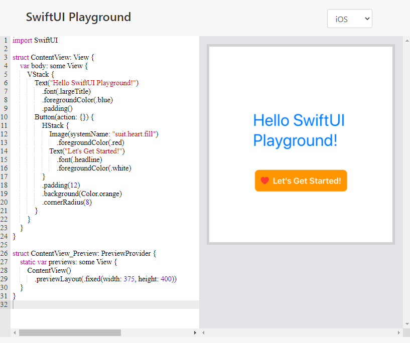

# UI development

There are two official UI frameworks provided by Apple: UIKit and SwiftUI.

UIKit is the originally used framework for UI development. It relies on defining the UI in a separate file (storyboard or xib) and the behavior in a swift file. In 2019, Apple release the first version of SwiftUI. 

The remainder of this training focuses on SwiftUI.

## SwiftUI 

SwiftUI brings a new approach to build UIs that we can summarize as follows:

- All the UI is defined in Swift code. Storyboards or xibs are not needed anymore.
- The UI is defined in a declarative style.
- States and bindings allow to hold the app data. The app UI updates automatically when these data change.
- UI elements are structs that inherit from View.
- Complex views can be defined by breaking them into smaller views. This is called view composition.
- The modifier technique is used to apply modifications to a view. A modifier returns a new view each time.

The [official documentation of SwiftUI is available here](https://developer.apple.com/documentation/swiftui).

## Prerequisites

It is recommended to use Xcode to learn and create SwiftUI apps.
There is a [web playground](https://swiftui-playground.kishikawakatsumi.com/) that can do the job, but it looks like it's unstable sometimes.
You can see a screenshot of the tool below.

Another promising alternative to watch is [compnerd's windows port](https://github.com/compnerd/swift-win32) of UIKit and SwiftUI.
So, if you can have a recent version Xcode running, this would be the best way to experience SwiftUI.

## PW: complete the official SwiftUI tutorial

Apple provides a [SwiftUI tutorial](https://developer.apple.com/tutorials/swiftui) that covers most of the basic use cases such as creating views and handling inputs, animations and transitions.

You can start the tutorial by clicking on "Get started". 

You can also navigate between the different tutorials by using the top bar.

## A summary of important concepts

- State: 
- Binding
- EnvironmentObject
- Observable

