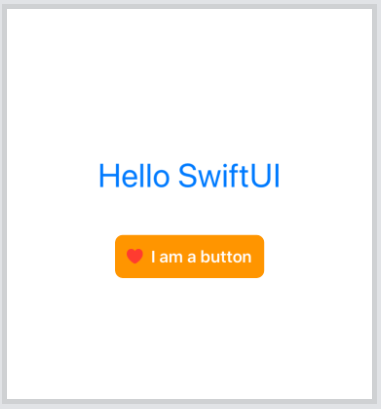
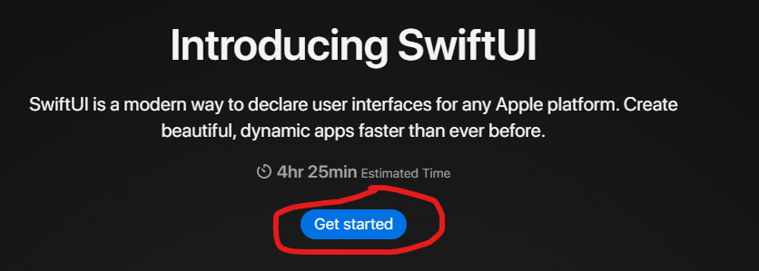

# UI development

::: tip Estimated time
1/2 day
:::

There are two official UI frameworks provided by Apple: UIKit and SwiftUI.

UIKit is the originally used framework for UI development. It relies on defining the UI in a separate file (storyboard or xib) and the behavior in a swift file. In 2019, Apple release the first version of SwiftUI. 

The remainder of this training focuses on SwiftUI.

## SwiftUI 

SwiftUI brings a new approach to build UIs that we can summarize as follows:

- All the UI is defined in Swift code. Neither Storyboards nor xibs are needed anymore.
- The UI is defined in a declarative style.
- States and bindings allow to hold the app data. The app UI updates automatically when these data change.
- UI elements are structs that conform to the View protocol.
- Complex views can be defined by breaking them into smaller views. This is called view composition.
- The modifier technique is used to apply modifications to a view. A modifier returns a new view each time.

The [official documentation of SwiftUI is available here](https://developer.apple.com/documentation/swiftui).

## Prerequisites

It is recommended to use Xcode to learn and create SwiftUI apps.
For simple apps, we can use the [Swift Playgrounds](https://www.apple.com/swift/playgrounds/) app.
There is a [web playground](https://swiftui-playground.kishikawakatsumi.com/) that can be exceptionally used.
You can see a screenshot of the tool below.


Another promising alternative to watch is [compnerd's windows port](https://github.com/compnerd/swift-win32) of UIKit and SwiftUI.
So, if you can have a recent version Xcode running, this is be the best IDE for SwiftUI development.

## Anatomy of a simple view

The following code shows a sample view.

```swift
struct ContentView: View {
    var body: some View {
        VStack {
            Text("Hello SwiftUI")
                .font(.largeTitle)
                .foregroundColor(.blue)
                .padding()
            Button(action: {}) {
                HStack {
                    Image(systemName: "suit.heart.fill")
                        .foregroundColor(.red)
                    Text("I am a button")
                        .font(.headline)
                        .foregroundColor(.white)
                }
                .padding(12)
                .background(Color.orange)
                .cornerRadius(8)
            }
        }
    }
}
```

As noted earlier, it is a struct that conforms to the view protocol.
This protocol defined a computed property that returns a View as an opaque type.

The body of the view has a `VStack` as its root element.
A `VStack` is a container view that arrange its direct children vertically (on a column).
The first child is a `Text` view and its second child is a `Button`.

The `Text` view chains calls to some methods that we call *modifiers*.
They allow to do anything that we want to the view that called it and they return a new `View` instance.
This means that we can apply another modifier to the result of a modifier and so on (this is called chaining).
This allows modifiers to have a declarative syntax that makes the code easy to understand.
SwiftUI provides built-in modifiers and allows us to create custom ones.
Can you match all the modifiers used in the code and their effects ?

::: details The modifiers used are:
```swift
font(...)
foregroundColor(...)
padding(...)
background(...)
cornerRadius(...)
```
:::

The button has no action, meaning that is does nothing on click and its content is defined as an `HStack`.
An `HStack` is a container view that arrange its direct children horizontally (on a row).
The stack contains an image and a button.

The view renders as illustrated by the image below.



Let's do more SwiftUI.

## PW: complete the official SwiftUI tutorial

Apple provides a [SwiftUI tutorial](https://developer.apple.com/tutorials/swiftui) that covers most of the basic use cases such as creating views and handling inputs, animations and transitions.

You can start the tutorial by clicking on "Get started". 



You can also navigate between the different tutorials by using the top bar.


## A summary of important concepts

- State: 
- Binding
- EnvironmentObject
- Observable

