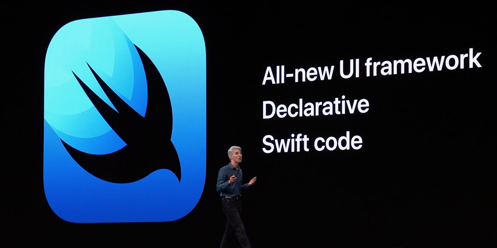

# Presentation de iOS dévelopement

## Qu'est-ce que iOS development ?

Le développement iOS consiste à développer des applications qui ciblent les iPhones, iPads, macOS, iWatch et Apple TV.
Il y a plusieurs façons d'y parvenir :

- En utilisant des frameworks et outils officiels développés par Apple
- En utilisant frameworks et outils tiers tels que Capacitor et FLutter

Cette formation se concentre sur le développement iOS en utilisant les outils et frameworks officiels proposés par Apple. Notre pile de développement consistera sur les éléments suivants :

- Language: Swift
- Framework: SwiftUI
- IDE: Xcode

En plus de cela, il est également possible d'exploiter le langage Swift afin de développer des applications de console et des serveurs sur Windows, Linux, macOS.

## Historique

Les premiers jours du développement iOS ont été réalisés en utilisant le langage Objective-C, le framework CocoaTouch et -le bon vieux- Xcode.
Cet écosystème était basique mais assez puissant et permettait de développer des applications étonnantes.
Les mises à jour continues d'Apple ont rendu le développement beaucoup plus convivial pour les développeurs.
Par exemple, la gestion de la mémoire est devenue automatique (grâce à ARC) et le système de mise en page est devenu capable de s'adapter à différentes tailles d'écran.

Lors de la WWDC 2014, Apple a annoncé le langage Swift comme remplaçant moderne de l'Objective-C.
Suite à cela, Apple a annoncé lors de la prochaine WWDC SwiftUI en remplacement de CocoaTouch.

À partir de 2021, la majorité des nouveaux projets iOS utilisent Swift et SwiftUI avec CocoaTouch comme solution de secours.

## Liens et références

- [Apple annonce SwiftUI, un cadre d'interface utilisateur déclaratif moderne pour les plates-formes Apple](https://9to5mac.com/2019/06/03/apple-announces-swiftui-a-modern-declarative-user-interface-framework-for-apple-platforms/)